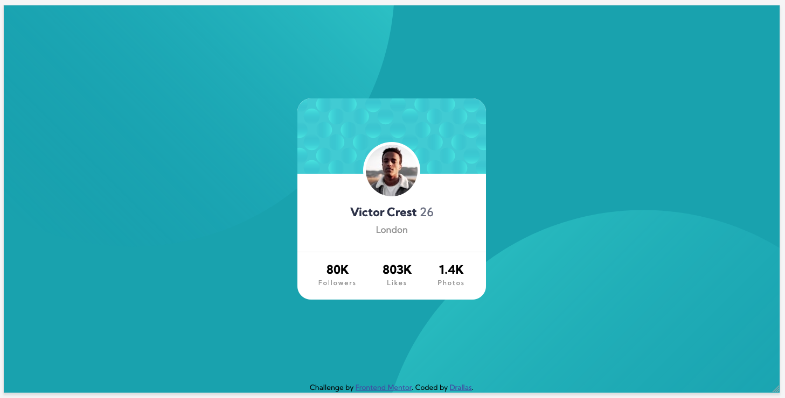

# Frontend Mentor - Profile card component solution

This is a solution to the [Profile card component challenge on Frontend Mentor](https://www.frontendmentor.io/challenges/profile-card-component-cfArpWshJ). Frontend Mentor challenges help you improve your coding skills by building realistic projects. 

## Table of contents

- [Overview](#overview)
  - [The challenge](#the-challenge)
  - [Screenshot](#screenshot)
  - [Links](#links)
- [My process](#my-process)
  - [Built with](#built-with)
  - [What I learned](#what-i-learned)
  - [Continued development](#continued-development)
  - [Useful resources](#useful-resources)
- [Author](#author)


## Overview

### The challenge

- Build out the project to the designs provided

### Screenshot



### Links

- Solution URL: [GitHub](https://github.com/Drallas/Profile-Card-Component)
- Live Site URL: [GitHub Pages](https://drallas.github.io/Profile-Card-Component/)

## My process

### Built with

- Semantic HTML5 markup
- CSS custom properties
- Flexbox
- BEM CSS
- Mobile-first workflow

### What I learned

Lesson to take away; even a 'simple card' component is constructed out of many sub elements and needs to be thought trough before coded.

**Dual Background**

I never used it, so i had to research it a bit. Main question marks, "should i set dual background image and how do i position them"? It's Possible and not that hard.

```css
#example1 {
  background-image: url(img_flwr.gif), url(paper.gif);
  background-position: right bottom, left top;
  background-repeat: no-repeat, no-repeat;
}
```

**Background Position**
Setting the background-position was more tricky, but with some trial and error i ended up with this code.

```css
background-position: left -40rem top -30rem, right -40rem bottom -30rem;
```

**Card Picture**

Had to figure out how to place picture and make it overflow the card background. 

```css
box-sizing: content-box;  # To exclude the 5px border box size.
position: absolute;	# To give the initial postion.
transform: translate(-50%, -100%); # To move it over to the correct spot.
```

### Continued development

I still struggle a bit with the many options to layout and position divs, other point of improvement are that i struggle a bit with correct BEM class naming; i'm going to ask some advice. For the card rem value's didn't work so good and px seemed to be better to recreate the card exact (almost pixel perfect).

### Useful resources

- Resources to solve this challenge where searching the web, my Notion notes library and a bit code from previous challenges. 

## Author

- Frontend Mentor - [@Drallas](https://www.frontendmentor.io/profile/Drallas)
- Dev.to - [@Drallas](https://dev.to/drallas)


